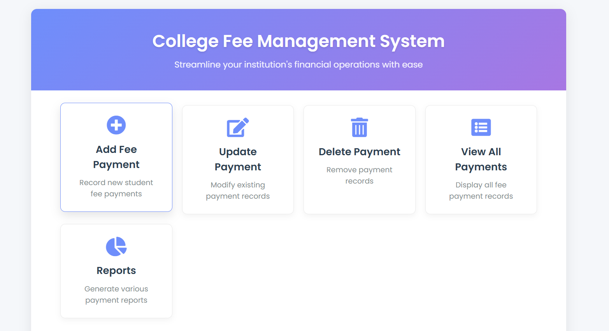
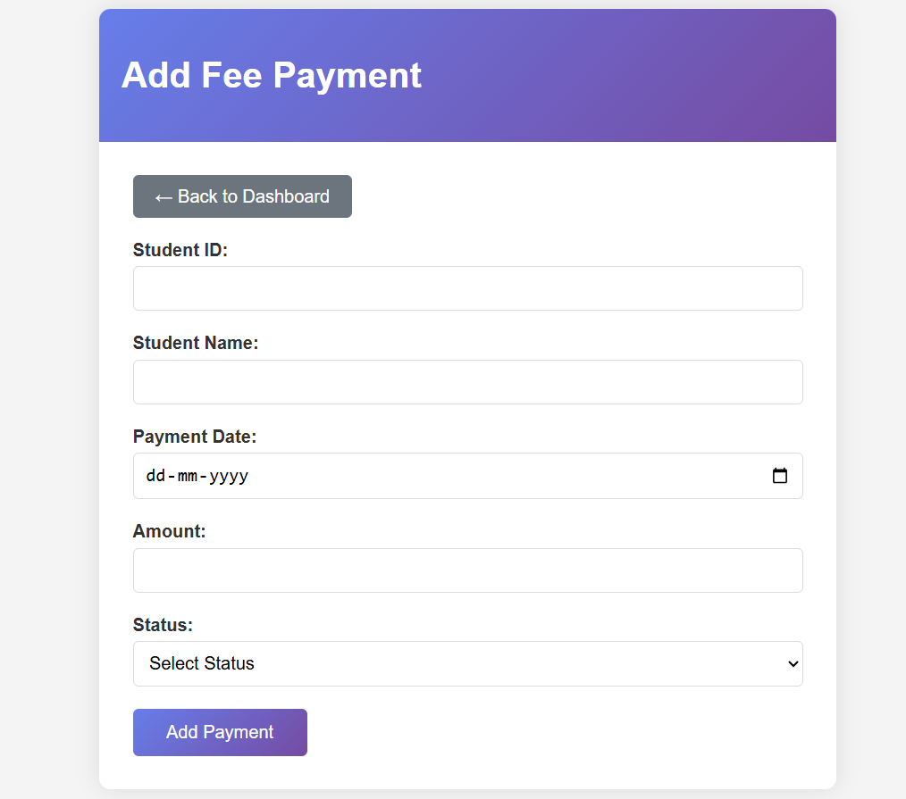
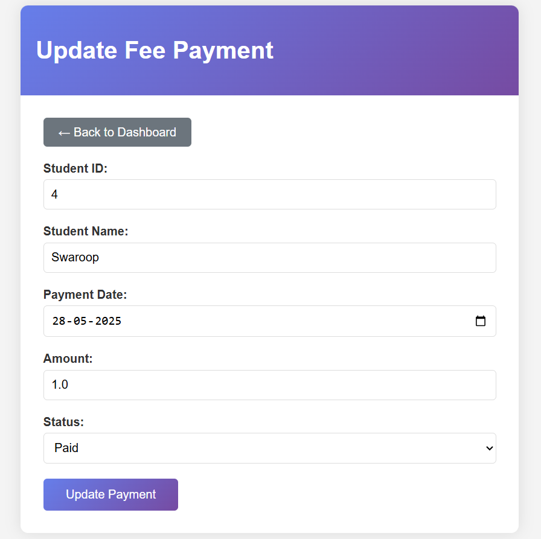
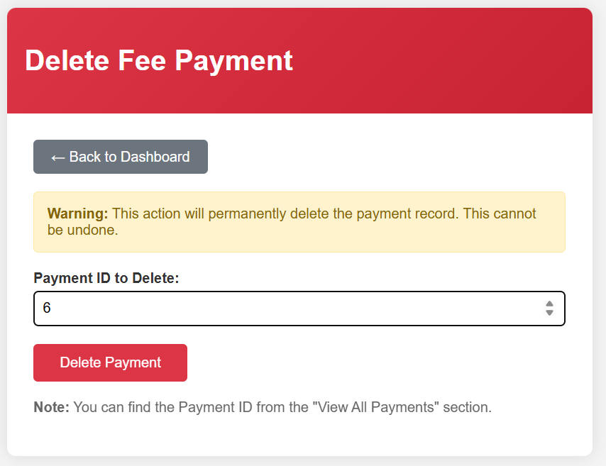
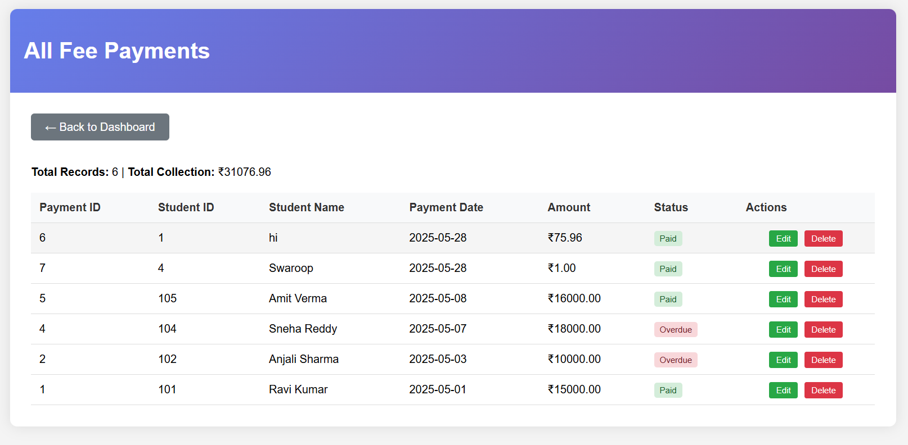
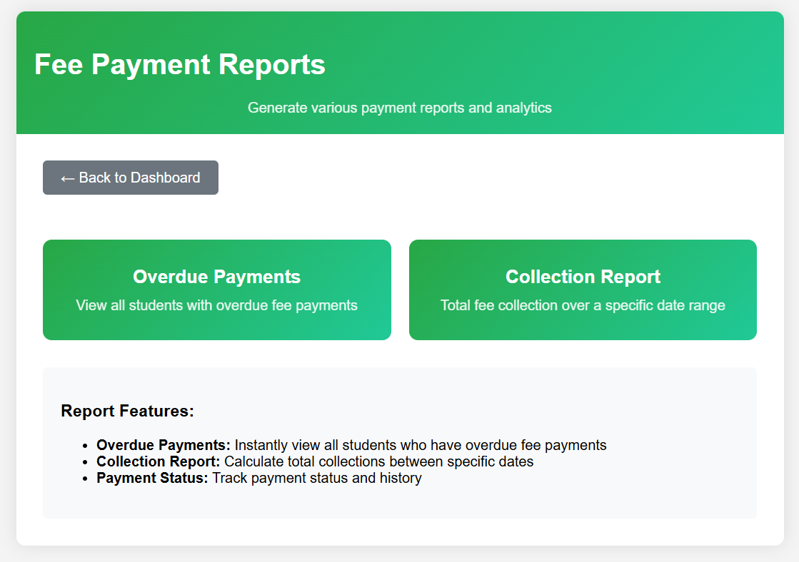

# 💳 College_Fee_Management_System

**Subject Name**: Advanced Java

**Subject Code**: BCS613D

**Name**: Swaroop

**USN**: 4AL22CS176

**Sem/Section**: VI / C

---
A web-based system developed using JSP, Servlets, and MySQL, following the MVC architecture. It provides a user-friendly platform for managing student fee records, tracking payments, and generating financial reports.

## 🚀 Key Features

**Full CRUD Functionality**: Add, update, delete, and view student fee records

**Search Functionality**: Find payment history via Student ID

**Dynamic Reports**:

Students with overdue or pending payments

Students who haven’t paid within a specific date range

Total fee collection over a selected period

## 📋 Prerequisites

-**Java Development Kit (JDK)**

-**Apache Tomcat Server – Version 9.0**

-**MySQL Server (or XAMPP with MySQL support)**

-**MySQL JDBC Driver (mysql-connector-java)**

-**Integrated Development Environment (IDE)**

-**Modern Web Browser**: Chrome

## 📦 Project Structure

```
CollegeFeeWebApp/
├── src/
│   ├── dao/
│   │   └── FeePaymentDAO.java
│   ├── model/
│   │   └── FeePayment.java
│   └── servlet/
│       ├── AddFeePaymentServlet.java
│       ├── UpdateFeePaymentServlet.java
│       ├── DeleteFeePaymentServlet.java
│       ├── DisplayFeePaymentsServlet.java
│       ├── ReportServlet.java
│       └── ReportCriteriaServlet.java
├── WebContent/
│   ├── index.jsp
│   ├── feepaymentadd.jsp
│   ├── feepaymentupdate.jsp
│   ├── feepaymentdelete.jsp
│   ├── feepaymentdisplay.jsp
│   ├── reports.jsp
│   ├── report_form.jsp
│   └── report_result.jsp
├── WEB-INF/
│   └── web.xml
└── README.md
```

## 🗄️ Database Configuration

### Step 1: Create Database

```sql
CREATE DATABASE IF NOT EXISTS college_fees;
college_fees;
```

### Step 2: Create Table

```sql
CREATE TABLE FeePayments (
    PaymentID INT PRIMARY KEY AUTO_INCREMENT,
    StudentID INT,
    StudentName VARCHAR(100),
    PaymentDate DATE,
    Amount DECIMAL(10,2),
    Status VARCHAR(20)
);
```

### Step 3: Insert Sample Data

```sql
INSERT INTO FeePayments (StudentID, StudentName, PaymentDate, Amount, Status) VALUES
(171, 'Swaroop', '2024-04-01', 25000.00, 'Paid'),
(172, 'Dhoni', '2024-05-15', 15000.00, 'Overdue'),
(173, 'Vinith', '2024-06-10', 30000.00, 'Paid');
```

## 🔧 Installation & Setup

### Step 1: Environment Setup

-JDK 8 or above

-Apache Tomcat 9+

-MySQL Server or XAMPP

-Eclipse / IntelliJ (J2EE IDE)

-MySQL Connector/J

### Step 2: Configure JDBC in FeePaymentDAO.java

```java
connection = DriverManager.getConnection(
    "jdbc:mysql://localhost:3306/college_fees",
    "root",
    ""
);
```

### Step 3: Deploy to Tomcat

Create a Dynamic Web Project in your IDE

Import files as per structure

Add MySQL connector to WEB-INF/lib

Start the server and visit:

```
http://localhost:8080/collegefeemanagement/
```

## 📸 Screenshots

### 🏠 Home Page



### ➕ Add Fee Payment



### ✏️ Update Payment



### ❌ Delete Record



### 🆕 Display Payments



### 📊 Generate Report




